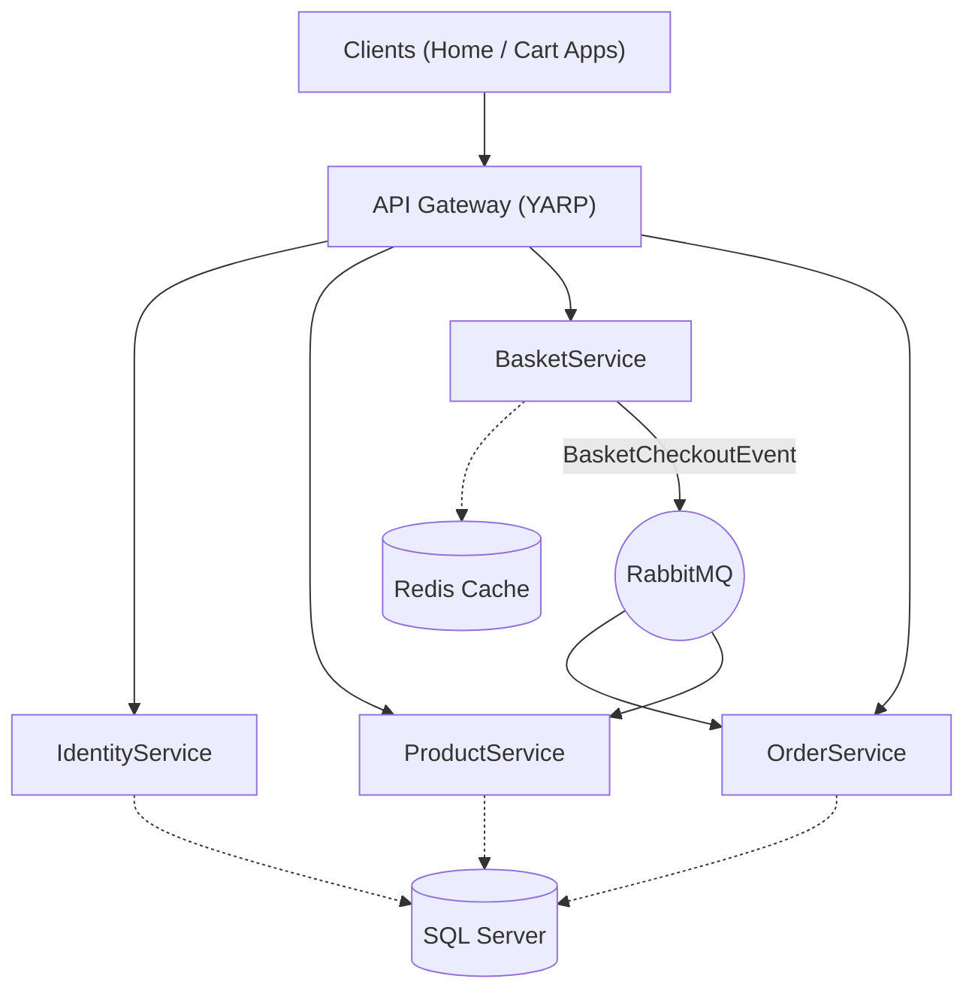

# 🚀 E-Commerce Microservices & Micro-Frontends Architecture


Case Study Project — Microservices + Micro-Frontend Architecture

This project demonstrates a modern **e-commerce architecture** built using **microservices** and **micro-frontends**.

The system consists of:

- **Event-driven backend microservices** built with .NET  
- **RabbitMQ / MassTransit** for asynchronous communication  
- **API Gateway (YARP)** as the single entry point  
- **Two independent Next.js micro-frontends**  
- **Docker Compose** orchestration for full end-to-end deployment  

The goal of this case study is to demonstrate how independently deployable services and frontends can work together while following **12-Factor Application** principles.

---

# 🏗️ System Architecture

The system follows a layered microservices architecture.



---

# 🧰 Infrastructure Services

| Service | Purpose |
|------|------|
| SQL Server | Persistent relational data |
| Redis | Distributed caching for baskets |
| RabbitMQ | Message broker for event-driven communication |
| Seq | Centralized structured logging |

---

# 🛠️ Technology Stack

| Area | Technologies |
|-----|-------------|
| **Backend** | .NET / ASP.NET Core, EF Core, MassTransit, Serilog, YARP, FluentValidation, MediatR (CQRS) |
| **Frontend** | Next.js (App Router), React, TailwindCSS, Axios, React-Toastify |
| **Infrastructure** | Docker Compose, SQL Server, Redis, RabbitMQ, Seq |

---

# 🧩 Core Components

## 1️⃣ API Gateway

**Location**

```
src/Gateways/ApiGateway
```

The API Gateway acts as the **single entry point** for all client requests (BFF Pattern).

### Responsibilities

- Reverse proxy routing via **YARP**
- **JWT validation**
- **Rate limiting**
- **CORS configuration**
- Centralized logging

### External Access

```
http://localhost:5153
```

---

# ⚙️ Backend Microservices

## 🔐 IdentityService

Responsible for **authentication and authorization**.

### Features

- User registration
- Login
- JWT access token generation
- Refresh token support

### Configuration

Sensitive values such as secrets follow **12-Factor principles** and are provided via environment variables.

Example:

```
JwtSettings__Secret
```

---

## 📦 ProductService

Responsible for **product management**.

### Features

- Product CRUD operations
- CQRS architecture
- Stock updates via events

### Event Integration

Consumes the event:

```
BasketCheckoutEvent
```

to **update product stock** after checkout.

---

## 🛒 BasketService

Responsible for **shopping cart management** using Redis.

### Features

- High-performance Redis caching
- Basket CRUD operations
- Checkout trigger
- Event publishing

### Key Endpoints

| Method | Endpoint | Description |
|------|------|------|
| GET | `/api/Basket/{userName}` | Get user's basket |
| POST | `/api/Basket` | Update basket |
| DELETE | `/api/Basket/{userName}` | Clear basket |
| POST | `/api/Basket/Checkout` | Trigger checkout event |

---

## 📦 OrderService

Responsible for **order lifecycle management**.

### Flow

The service listens for the following event:

```
BasketCheckoutEvent
```

When received:

1. A new **order record** is created in the database.
2. The process happens **asynchronously** via RabbitMQ.

---

# ⚡ Event Driven Architecture

The checkout process is fully asynchronous to ensure **loose coupling** between services.

### Checkout Flow

1. User clicks **Checkout**
2. `BasketService` publishes **BasketCheckoutEvent**
3. RabbitMQ routes the event
4. `OrderService` consumes event → **Creates Order**
5. `ProductService` consumes event → **Updates Stock**

This approach enables:

- Loose coupling  
- High scalability  
- Independent service evolution  

---

# 🖥️ Micro-Frontend Architecture

The project includes **two independent Next.js applications** functioning as a single store.

| Application | Port | Purpose |
|------|------|------|
| Home | 3000 | Product browsing, Login, Add to Cart |
| Cart | 3001 | Basket management, Checkout |

Each frontend runs in its own **Docker container**.

All backend communication happens through the **API Gateway**.

Environment configuration example:

```
NEXT_PUBLIC_API_URL=http://localhost:5153/api
```

---

# 🔄 Frontend Synchronization

Since the frontends are **separate applications**, synchronization is achieved using two mechanisms.

### Shared Backend State

Both applications read basket data from **Redis via BasketService**.

### Custom DOM Events

The Home application triggers a custom event:

```
window.dispatchEvent(new Event("basketUpdated"))
```

The Navbar listens for this event to update the **basket item counter instantly**.

---

# 🚀 Running the Project

## Prerequisites

- Docker
- Docker Compose

---

## Start the System

Run the following command in the project root directory:

```bash
docker-compose up --build
```

This will start:

- Infrastructure services
- Backend microservices
- Frontend micro-frontends

---

# 🌐 Access Points

| Service | URL | Credentials |
|------|------|------|
| Home Frontend | http://localhost:3000 | - |
| Cart Frontend | http://localhost:3001 | - |
| API Gateway | http://localhost:5153 | - |
| Seq Logs | http://localhost:5341 | - |
| RabbitMQ UI | http://localhost:15672 | guest / guest |

---
# 🔑 Demo User (Test Account)

A default user account is available in the system so you can quickly test the application.

| Email | Password |
|------|------|
| bob@test.com | Pass123$ |

You can log in directly using this account and test the following flow:

1. Go to `http://localhost:3000`
2. Enter the credentials above on the **Login** screen
3. Add products to the basket
4. Navigate to the basket page and test the **Checkout** process

> ⚠️ This account is intended for **demo and development purposes only**.

---
# 🧪 Example User Flow

1. Go to

```
http://localhost:3000
```

2. Register and login.

3. Add products to the basket.

4. The **navbar basket counter updates instantly**.

5. Click the basket icon to navigate to:

```
http://localhost:3001/basket
```

6. Click **Checkout**.

7. Observe the asynchronous process through **Seq logs**.

---

# ⭐ Key Architecture Highlights

✅ **Microservices Architecture**  
Clear bounded contexts: Identity, Product, Basket, Order.

✅ **Micro-Frontend Architecture**  
Independent deployment and scaling of UI applications.

✅ **Event-Driven Communication**  
MassTransit + RabbitMQ for asynchronous workflows.

✅ **12-Factor Application Principles**  
Environment-based configuration and stateless services.

---